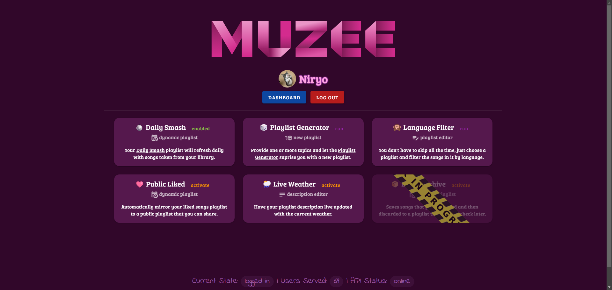
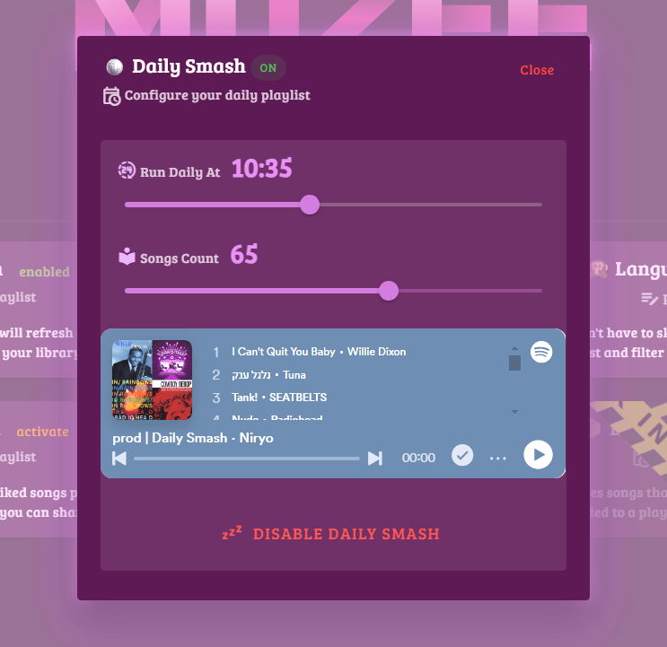
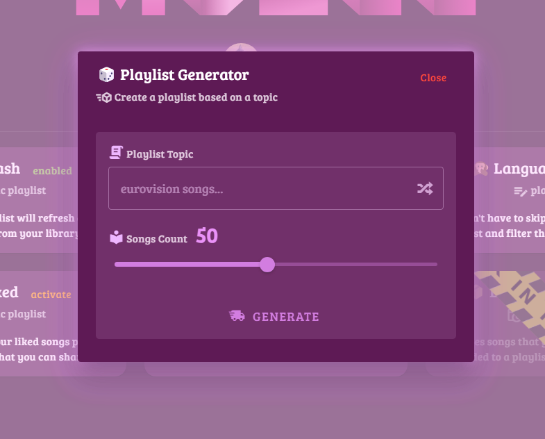

# 🎸 Muzee

Spotify utilities to increase productivity.

> [!TIP]
> We are live @ https://themuzee.web.app
> Currently on test-mode, create an issue to be whitelisted.

---

## 🎶 Feautures

- **🪩 Daily Smash**: Get a daily-refreshed playlist based on your Library playlists.
- **🎲 Playlist Generator**: Generate a playlist based on topics.
- **🙊 Language Filter**: Filter playlist songs based on language / charset.
- **🩷 Public Liked**: Share your liked songs with the world.
- **🌦️ Live Weather**: Update playlist description based on the weather.
- **📦 Liked Archive**: Automatically save unliked songs on an archive playlist.
- ... and more to come!

I coded this project using soft coding principles, so it's easy to add new features and maintain the codebase.

## 🖼️ Preview

### 🏠 Home


### 🪩 Daily Smash


### 🎲 Playlist Generator


## ☃️ Technologies

**UI** 
- Framework: [`🔰 Vue`](https://vuejs.org/)
- Components: [`💙 Vuetify`](https://vuetifyjs.com/en/)
- Hosting: [`🔥 Firebase Hosting`](https://firebase.google.com/docs/hosting)

**Server**
- Language:  Python 3.12
- Framework: [`🩷 Sanic`](https://sanic.dev/en/)
- Database: [`🐘 PostgreSQL`](https://www.postgresql.org/)
- Hosting: A [`🔵 DigitalOcean`](https://www.digitalocean.com/)'s `🍖 Ubuntu` droplet

## 🕺 Running

**UI**
```bash
cd ui/muzee
npm install

# development
npm run dev

# deployment
npm run build
firebase deploy
```

**Server**
```bash
pip install -r requirements.txt

# development
sanic server:dev --port 6969 --host 0.0.0.0

# deployment
sanic server:pod --port 6912 --host --single-process
```